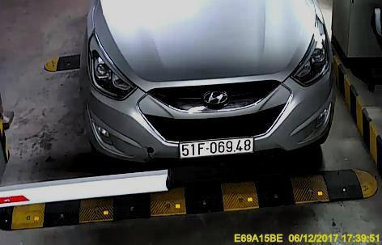
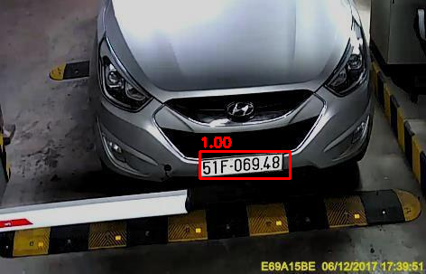
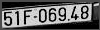
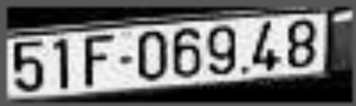
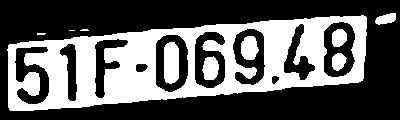

# License plate recognition
## Pipeline
- Detect plates with a finetuned YOLO model
- Crop the regions of interest
- Preprocess
- Perform OCR

## Demo
We first load a demo image:

We detect all plates:

We crop the region of interest:

We scale, normalize, and binarize:

### Results
> Detected: `51F069.489`

# TODO
- Improve cropping
- Improve OCR